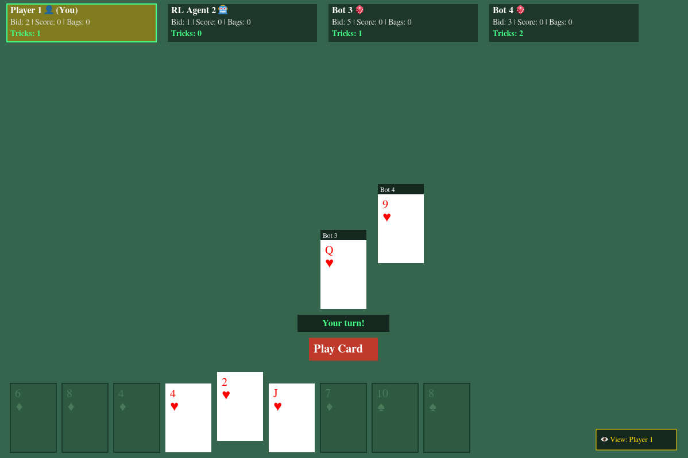
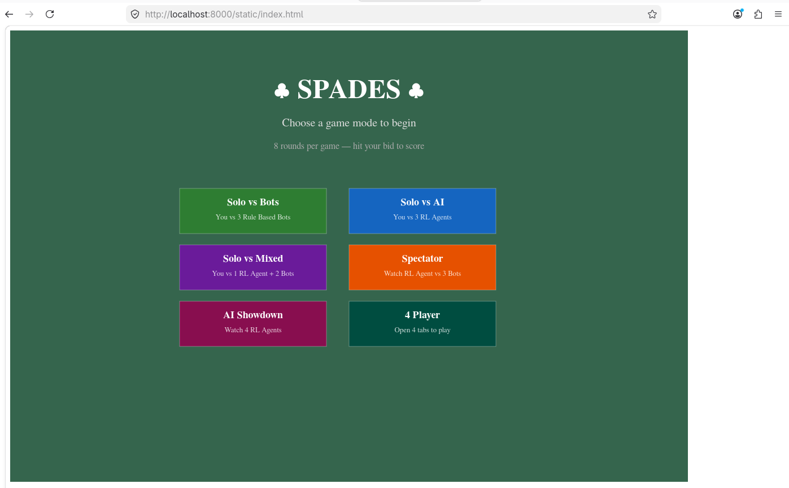

# Reinforcement Learning for Spades Game




## Requirements
- Python 3.10+

## Installation
To host the webserver, create a virtual environment in the project folder and install the dependencies with pip

```bash
python -m venv venv
source venv/bin/activate
pip install -r requirements.txt
```

The webserver can be started with the following command:
```bash
uvicorn main:app --reload
```



## Training
Although a spades_agent.zip is provided pre-trained, the agent is still very unoptimized.